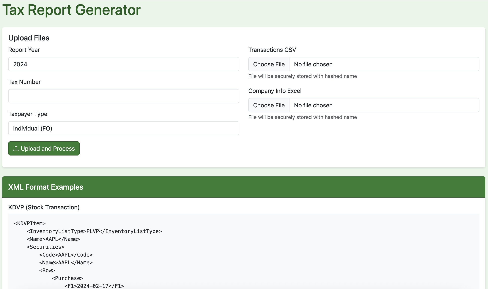
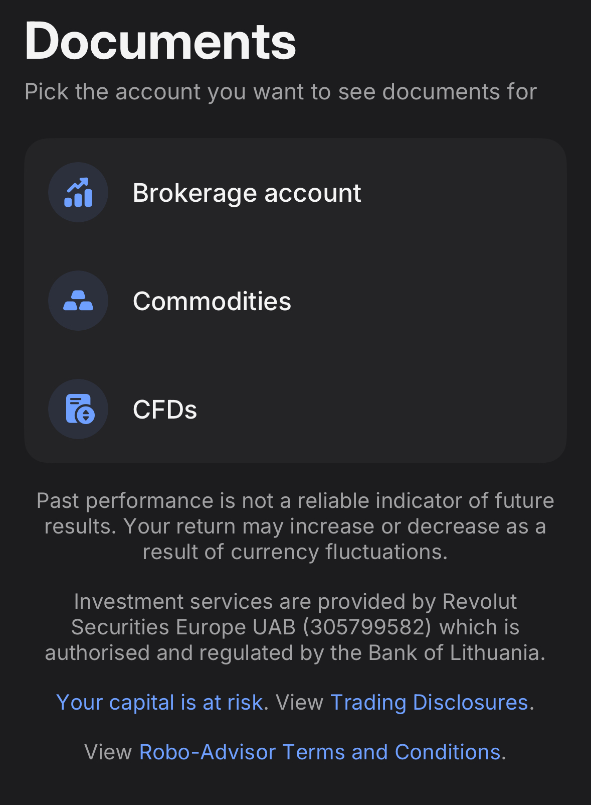
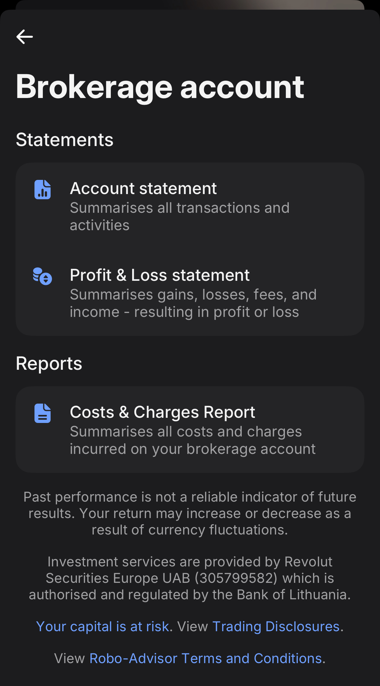
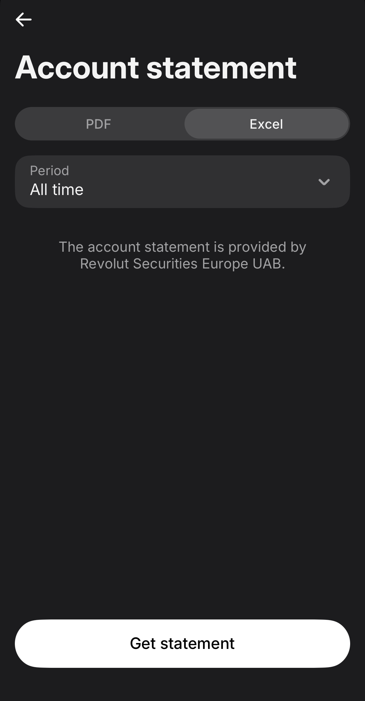
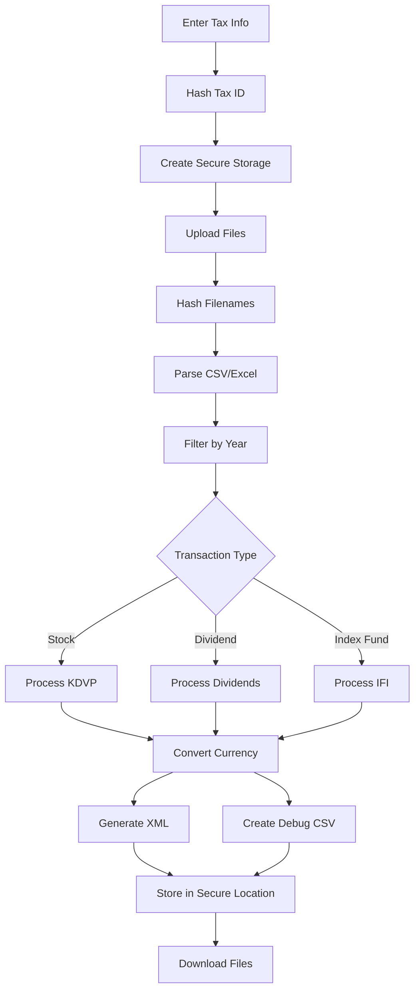

# Revolut -> eDAVKI tax report converter

A web application that generates tax report XML files for the Slovenian Financial Administration (FURS) from Revolut trading and dividend data.

[](https://www.python.org/downloads/)
[](https://flask.palletsprojects.com/)
[](https://python-poetry.org/)
[](LICENSE)

This application helps Slovenian taxpayers generate XML files for their tax reports from trading and dividend data. It supports:
- Capital Gains (KDVP) reports for stock trading
- Dividend Income reports
- Index Fund (IFI) reports

The application provides a user-friendly web interface for uploading transaction data, previewing the reports, and downloading the generated XML files in the format required by FURS.

## ⚠️ DISCLAIMER

**IMPORTANT: READ BEFORE USING**

This software is provided **"AS IS"**, without warranty of any kind, express or implied, including but not limited to the warranties of merchantability, fitness for a particular purpose, and noninfringement.

**The authors and contributors:**
- ❌ Make NO guarantees about the accuracy of generated tax reports
- ❌ Are NOT responsible for any errors, omissions, or miscalculations
- ❌ Are NOT liable for any financial, legal, or tax-related consequences
- ❌ Do NOT provide tax, legal, or financial advice

**Users are solely responsible for:**
- ✅ Verifying the accuracy of all generated reports
- ✅ Ensuring compliance with Slovenian tax laws
- ✅ Consulting with qualified tax professionals
- ✅ Reviewing all data before submission to FURS

**This tool is provided for convenience only.** Always verify generated XML files against your source data and consult with a tax professional before submitting to authorities.

By using this software, you acknowledge that you have read this disclaimer and agree to use the software at your own risk.

---

## Features

- Generates three types of tax reports:
  - **KDVP** (Capital Gains): For stock trading transactions
  - **Dividends**: For dividend income
  - **IFI**: For index fund transactions

- Secure data handling:
  - Taxpayer information is never stored in plaintext
  - File names are hashed for privacy
  - Separate storage for each taxpayer
  - Environment-based configuration

- Accurate currency conversion:
  - Uses FX rates from transaction data
  - Supports multiple currencies (USD, EUR, GBP, CHF, etc.)
  - Provides detailed conversion tracking

- Debug and verification tools:
  - Debug CSV files for each report type
  - Detailed logging with obscured sensitive data
  - Transaction preview before generation

## Table of Contents

- [Disclaimer](#️-disclaimer)
- [Features](#features)
- [Prerequisites](#prerequisites)
- [Installation](#installation)
  - [Docker Compose (Recommended)](#-docker-compose-recommended)
  - [Poetry (Local Development)](#-poetry-local-development)
  - [Manual Installation (Alternative)](#-manual-installation-alternative)
- [Usage](#using-the-application)
- [Make Commands](#make-commands)
- [Security](#security)
- [Contributing](#contributing)
- [License](#license)

## Prerequisites

### Recommended (Docker)
- Docker and Docker Compose

### Alternative (Local Development)
- Python 3.12+
- Poetry 2.1.3+ or pip

## Installation

### 🐳 Docker Compose (Recommended)

**Docker Compose is the preferred method for running this application.** It provides:
- ✅ Consistent environment across all systems
- ✅ No Python/Poetry installation required
- ✅ Automatic dependency management
- ✅ Production-ready configuration with Gunicorn
- ✅ Easy switching between development and production modes

1. Clone the repository:
   ```bash
   git clone https://github.com/JakaCikac/revolut-edavki.git
   cd revolut-edavki
   ```

2. Create your environment file:
   ```bash
   cp .env.example .env
   # Edit .env with your settings:
   # TAX_SALT=your_random_salt_here
   # UPLOAD_PATH=/path/to/secure/storage
   ```

3. **For Development** (Flask dev server with hot reload):
   ```bash
   # Build and start in development mode
   docker-compose --profile dev up --build

   # Or use the Makefile shortcut
   make docker-dev
   ```

4. **For Production** (Gunicorn with auto-scaling workers):
   ```bash
   # Build and start in production mode
   docker-compose --profile production up --build

   # Or use the Makefile shortcut
   make docker-prod
   ```

5. Access the application at:
   ```
   http://localhost:59855
   ```

   The application should look like this:

   

6. View logs:
   ```bash
   # Development
   docker-compose --profile dev logs -f

   # Production
   docker-compose --profile production logs -f
   ```

7. Stop the application:
   ```bash
   # Development
   docker-compose --profile dev down

   # Production
   docker-compose --profile production down
   ```

**Note:** The `uploads` directory is mounted as a volume, so your data persists between container restarts.

**Profiles:**
- `dev`: Flask development server with debug mode and hot reload
- `production`: Gunicorn WSGI server with multiple workers, non-root user, and optimized for production

### 📦 Poetry (Local Development)

1. Clone the repository:
   ```bash
   git clone https://github.com/JakaCikac/revolut-edavki.git
   cd revolut-edavki
   ```

2. Install Poetry if you haven't already:
   ```bash
   curl -sSL https://install.python-poetry.org | python3 -
   ```

3. Install dependencies:
   ```bash
   poetry install
   ```

4. Edit the .env file:
   ```bash
   cp .env.example .env
   # Edit .env with your settings:
   # TAX_SALT=your_random_salt_here
   # UPLOAD_PATH=/path/to/secure/storage
   ```

5. Run the tests:
   ```bash
   poetry run pytest tests/
   ```

6. Run the application:
   ```bash
   poetry run python server.py --port 55952 --host 0.0.0.0
   ```

### 🔧 Manual Installation (Alternative)

1. Create and activate a virtual environment:
   ```bash
   python3 -m venv venv
   source venv/bin/activate  # On Windows: venv\Scripts\activate
   ```

2. Install the package:
   ```bash
   pip install -e .
   ```

3. Set up environment variables:
   ```bash
   cp .env.example .env
   # Edit .env with your settings:
   # TAX_SALT=your_random_salt_here
   # UPLOAD_PATH=/path/to/secure/storage
   ```

4. Run the tests:
   ```bash
   pytest tests/
   ```

5. Run the application:
   ```bash
   python server.py --port 55952 --host 0.0.0.0
   ```

### Command Line Options

```bash
revolut-edavki --help
Usage: revolut-edavki [OPTIONS]

  Start the revolut-edavki web application.

Options:
  -p, --port INTEGER  Port to run the server on (default: 59855)
  -h, --host TEXT     Host to bind to (default: 127.0.0.1)
  --debug            Enable debug mode
  -c, --config PATH  Path to config file
  --help            Show this message and exit
```

Example:
```bash
# Run on a different port
revolut-edavki --port 8080

# Run in debug mode
revolut-edavki --debug

# Use a specific config file
revolut-edavki --config /path/to/.env
```

### Security Configuration

The application uses several security measures:

1. **Taxpayer ID Protection**:
   - Tax numbers are hashed using SHA-256 with a salt
   - Salt is configured via environment variable
   - Each taxpayer's files are stored in a separate directory

2. **File Privacy**:
   - Uploaded files are renamed using hashed names
   - Original filenames are never stored
   - Files are stored in taxpayer-specific directories

3. **Environment Variables**:
   - `TAX_SALT`: Salt for hashing tax numbers (required)
   - `UPLOAD_PATH`: Secure storage location (optional)
   - `DEBUG`: Enable/disable debug mode (optional)

## Input Files

### How to Get Account Statement from Revolut App

To export your transaction data from Revolut:

1. **Open the Revolut app** and go to the **Invest** tab
2. Click **More** (three dots menu)
3. Select **Documents**

**⚠️ IMPORTANT:** Make sure to select **"All time"** as the period so that all buy and sell pairs are properly recorded!







### transactions.csv
Contains all trading and dividend transactions with the following columns:
- `Date`: Transaction date (YYYY-MM-DD)
- `Type`: Transaction type (BUY, SELL, DIVIDEND)
- `Ticker`: Stock symbol
- `Quantity`: Number of shares
- `Price per share`: Price per share in original currency
- `Total Amount`: Total transaction amount in original currency
- `Currency`: Original currency (USD, EUR, etc.)
- `FX Rate`: Exchange rate to EUR on transaction date

Example:
```csv
Date,Type,Ticker,Quantity,Price per share,Total Amount,Currency,FX Rate
2024-01-03,DIVIDEND,GRMN,100,0,1.46,USD,1.0700
2024-02-17,BUY,AAPL,50,180.75,-9037.50,USD,1.0800
2024-03-15,SELL,MSFT,30,420.25,12607.50,USD,1.0900
```

### Company_info.xlsx
Contains company information with the following columns:
- `Symbol`: Stock ticker symbol
- `Name`: Company name
- `Address`: Company address
- `CountryCode`: Company's country code
- `ISIN`: International Securities Identification Number

Example:
```
Symbol | Name        | Address                              | CountryCode | ISIN
GRMN   | Garmin Ltd | Mühlentalstrasse 2, Schaffhausen... | USA         | CH0114405324
AAPL   | Apple Inc  | One Apple Park Way, Cupertino...    | USA         | US0378331005
```

## Running the Application

1. Clone the repository or download the files
2. Navigate to the project directory
3. Install the required packages:
   ```bash
   pip install flask flask-cors pandas openpyxl requests
   ```
4. Start the server:
   ```bash
   python app.py
   ```
5. Open your web browser and go to:
   ```
   http://localhost:51408
   ```

## Make Commands

The project includes a Makefile for common tasks:

```bash
# Show all available commands
make help

# Docker commands (recommended)
make docker-dev      # Run with Docker in development mode
make docker-prod     # Run with Docker in production mode

# Development commands (for local Poetry setup)
make install         # Install dependencies with Poetry
make test           # Run tests with coverage
make lint           # Run all linters (pylint, mypy, black, isort)
make format         # Format code with black and isort
make security       # Run security checks with bandit
make pre-commit     # Install pre-commit hooks
make clean          # Clean up generated files
make all            # Run format, lint, security, and test
```

**Quick Start:**
```bash
# Development with Docker (recommended)
make docker-dev

# Production with Docker (recommended)
make docker-prod

# Local development with Poetry
make install
make test
poetry run python server.py
```

## Using the Application

1. Select the reporting year (default is current year)
2. Upload your transactions.csv file from Revolut
3. Upload your Company_info.xlsx file (example: `Company_info_2024.xlsx`)
4. Enter your tax number
5. Click "🚀 Generate Reports"
5. Review the preview tables for:
   - Stock transactions (KDVP)
   - Dividends
   - Index funds (IFI)
6. Download the generated XML files:
   - Doh-KDVP.xml
   - Doh-Dib.xml
   - D-IFI.xml

## Output Files

### XML Reports

1. **Doh-KDVP.xml**: Capital gains report
   - Includes stocks with sales in the report year
   - All buy transactions (any year)
   - Only sell transactions from report year
   - All amounts converted to EUR

2. **Doh-Div.xml**: Dividend income report
   - All dividends from the report year
   - Company information included
   - Amounts converted to EUR

3. **D-IFI.xml**: Index fund report
   - All index fund transactions
   - Amounts converted to EUR

### Debug Files

1. **debug_kdvp.csv**: Details for stock transactions
   - Original amounts and currencies
   - FX rates used
   - EUR conversions
   - Running quantities

2. **debug_dividends.csv**: Details for dividends
   - Original amounts
   - FX rates
   - EUR conversions
   - Company details

3. **debug_ifi.csv**: Details for index funds
   - Transaction types
   - Original amounts
   - FX rates
   - EUR conversions

For uploading the reports to FURS please refer to
excellent instructions in https://github.com/masbug/etoro-edavki README.

## Currency Conversion

The application uses the following formula for currency conversion:

```python
EUR_amount = original_amount / fx_rate
```

Example:
- Original amount: 1.46 USD
- FX rate: 1.0700 EUR/USD
- EUR amount = 1.46 / 1.0700 = 1.36 EUR

## Project Structure
```
revolut_edavki/
├── app.py              # Web application
├── converter.py        # Core conversion logic
├── templates/
│   └── index.html     # Web interface
├── tests/
│   └── test_*.py      # Test files
├── requirements.txt    # Python dependencies
└── pyproject.toml     # Poetry configuration
```

## Error Handling

- Missing columns in Company_info.xlsx will be reported in the UI
- Invalid date formats in transactions.csv will be reported
- Invalid currency or FX rate values will be logged
- Detailed error messages in debug files

## XML Format Examples

### KDVP (Stock Transaction)
```xml
<KDVPItem>
    <InventoryListType>PLVP</InventoryListType>
    <Name>AAPL</Name>
    <Securities>
        <Code>AAPL</Code>
        <Name>AAPL</Name>
        <Row>
            <Purchase>
                <F1>2024-02-17</F1>
                <F2>B</F2>
                <F3>50.00000000</F3>
                <F4>167.36111111</F4>
            </Purchase>
        </Row>
    </Securities>
</KDVPItem>
```

### Dividend
```xml
<Dividend>
    <Date>2024-01-03</Date>
    <PayerName>Garmin Ltd</PayerName>
    <PayerAddress>Mühlentalstrasse 2, Schaffhausen</PayerAddress>
    <PayerCountry>USA</PayerCountry>
    <Type>1</Type>
    <Value>1.36</Value>
</Dividend>
```

## Flow Chart



## Security

Security is a priority for this project. We implement several security measures:

- **Data Privacy:** Tax numbers are hashed using SHA-256 with salt
- **File Security:** Uploaded files are hashed and stored securely
- **No Persistent Storage:** User data is not stored permanently
- **Input Validation:** All inputs are validated and sanitized
- **Environment Configuration:** Secrets managed via environment variables

For security concerns or to report vulnerabilities, please see [SECURITY.md](SECURITY.md).

### Security Best Practices

1. **Change the default salt:** Set a strong, random `TAX_SALT` in your `.env` file
2. **Use HTTPS:** If exposing to network, use a reverse proxy with TLS
3. **Keep updated:** Regularly update dependencies and the application
4. **Review outputs:** Always verify generated XML files before submission
5. **Secure environment:** Protect your `.env` file (chmod 600)

## Contributing

Contributions are welcome! Please see [CONTRIBUTING.md](CONTRIBUTING.md) for guidelines.

### Quick Start for Contributors

```bash
# Fork and clone the repository
git clone https://github.com/YOUR_USERNAME/revolut-edavki.git
cd revolut-edavki

# Install dependencies
poetry install

# Run tests
poetry run pytest

# Make your changes and submit a PR
```

## License

This project is licensed under a **Non-Commercial License** - see the [LICENSE](LICENSE) file for details.

**Summary:**
- ✅ **Free to use** for personal, educational, or non-profit purposes
- ✅ **Free to modify** and create derivative works
- ✅ **Free to distribute** and share with others
- ❌ **No commercial use** - Cannot be used for commercial purposes without permission
- ℹ️ **No attribution required** - Use freely for non-commercial purposes

The software is provided "AS IS" without warranty of any kind.

## Support

- **Documentation:** See this README and linked documents
- **Issues:** Report bugs via [GitHub Issues](https://github.com/JakaCikac/revolut-edavki/issues)
- **Discussions:** Ask questions in [GitHub Discussions](https://github.com/JakaCikac/revolut-edavki/discussions)
- **Security:** Report vulnerabilities via [SECURITY.md](SECURITY.md)

## Changelog

### 2026-02-15
- **Updated Doh-Div XML schema** to comply with FURS Doh_Div_3.xsd specification
  - `<Dividend>` elements are now direct children of `<body>` instead of nested inside `<Doh_Div>`
  - `<Doh_Div>` element now serves as metadata container with Period field
  - Updated both example XML file and code generator

## Acknowledgments

- Slovenian Financial Administration (FURS) for XML schema specifications
- Bank of Slovenia (BSI) for exchange rate data
- All contributors who help improve this project
- IB -> eDavki konverter: https://github.com/jamsix/ib-edavki (Copyright (c) 2020 Primož Sečnik Kolman; MIT License)
- Etoro -> eDavki konverter: https://github.com/masbug/etoro-edavki (Copyright (c) 2021 Masbug; MIT License)

---

**Made with ❤️ for Slovenian traders and investors**
